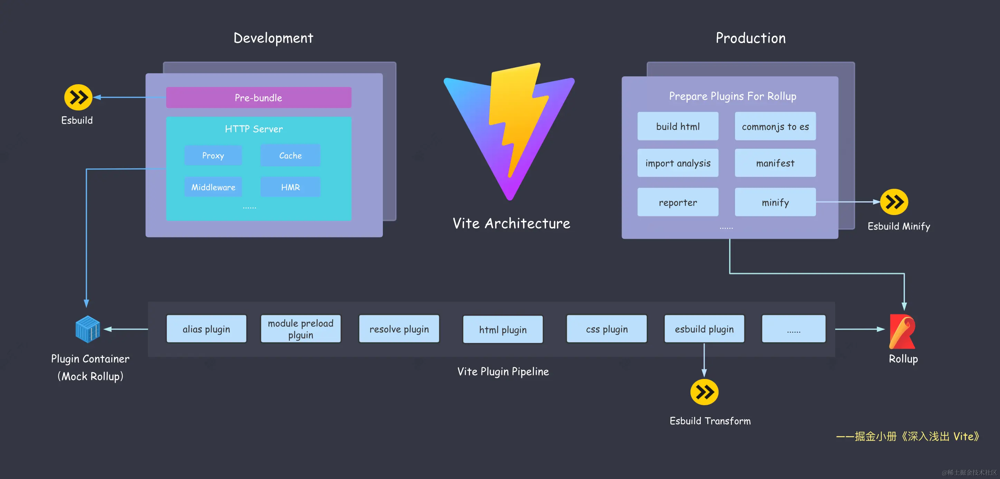
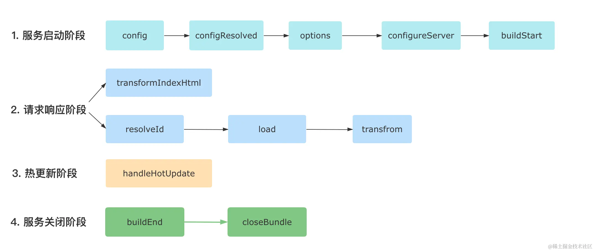

# mini-vite

Vite 原理学习项目，实现简易 Vite 及其相关工具链，并搭配相关教程。

- 基于 ESM bundle less 项目启动 ✅
- 基于 esbuild 预构建处理 ✅
- 实现类 Rollup 插件机制 ✅
  - 支持 resolveId load transform transformIndexHtml 钩子
- 实现 Hot Mod 热模块更新 🚀
- 相关搭建教程 🚀

## Vite 架构



> 站在巨人的肩膀上，基于 esbuild 与 rollup 实现

- pre-bundle 采用 esbuild 进行依赖预构建
  - 防止第三方库不支持 ES6
  - 防止瀑布流请求 部分库依赖层级较深 导致请求过多 需要打包成一个文件
- 生产环境代码压缩 esbuild

## 流程解析

- src/node/cli.ts 启动 cli 入口
  - serve/dev 启动 node 服务命令
- src/node/server/index.ts 启动 node 服务
  - 注册 rollup 插件机制 (三个内置 Plugin)
    - resolvePlugin 将路径全部转化为文件系统中的绝对路径便于读取与解析
    - esbuildTransformPlugin 将文件进行绝对路径的读取并使用 esbuild 进行编译
    - importAnalysisPlugin 编译文件，将 import 中的内容解析为预构建位置依赖
  - 注册 node 服务中间件
    - 将根路径指向 index.html 加载本地文件经过 plugin 处理后进行返回
    - 处理 js/ts 文件经过 plugin 钩子编译后进行返回
  - 对依赖进行预构建放置在 node_modules/.mini-vite (基于 esbuild 实现)
    - vite 基于 ESM 需要将不支持 ESM 导出的库打包一份 ESM 导出
    - 防止瀑布流请求引用，文件打包过于分散，导致 import 不断请求，导出一份大的 ESM chunk


## 简易 Esbuild 插件

```ts
const envPlugin = {
  name: 'env', // 插件名称
  setup(build) {
    // filter 正则匹配需要触发 CallBack 的 path
    
    // onResolve 制路径解析
    build.onResolve({ filter: /^env$/ }, args => ({
      path: args.path,
      namespace: 'env-ns',
    }))
    // 控制模块内容加载
    build.onLoad({ filter: /.*/, namespace: 'env-ns' }, () => ({
      contents: JSON.stringify(process.env),
      loader: 'json',
    }))
  },
}
```


### esbuild 缺点

- 不支持降级到 ES5 的代码。这意味着在低端浏览器代码会跑不起来。
- 不支持 const enum 等语法。这意味着单独使用这些语法在 esbuild 中会直接抛错。
- 不提供操作打包产物的接口，像 Rollup 中灵活处理打包产物的能力(如renderChunk钩子)在 Esbuild 当中完全没有。
- 不支持自定义 Code Splitting 策略。传统的 Webpack 和 Rollup 都提供了自定义拆包策略的 API，而 Esbuild 并未提供，从而降级了拆包优化的灵活性。

## Vite 插件



- Vite 插件钩子执行顺序
  - 服务启动阶段: config、configResolved、options、configureServer、buildStart 
  - 请求响应阶段: 如果是 html 文件，仅执行transformIndexHtml钩子；对于非 HTML 文件，则依次执行resolveId、load和transform钩子。相信大家学过 Rollup 的插件机制，已经对这三个钩子比较熟悉了。 
  - 热更新阶段: 执行handleHotUpdate钩子。 
  - 服务关闭阶段: 依次执行buildEnd和closeBundle钩子。

- Vite 插件执行顺序
  - Alias (路径别名)相关的插件。 
  - 带有 enforce: 'pre' 的用户插件。 
  - Vite 核心插件。 
  - 没有 enforce 值的用户插件，也叫普通插件。 
  - Vite 生产环境构建用的插件。 
  - 带有 enforce: 'post' 的用户插件。 
  - Vite 后置构建插件(如压缩插件)。

```js
// test-hooks-plugin.ts
// 注: 请求响应阶段的钩子
// 如 resolveId, load, transform, transformIndexHtml在下文介绍
// 以下为服务启动和关闭的钩子
export default function testHookPlugin () {
  return {
    name: 'test-hooks-plugin',
    // 'serve' 表示仅用于开发环境，'build'表示仅用于生产环境
    apply: 'serve',
    // apply(config, { command }) {
    //  // 只用于非 SSR 情况下的生产环境构建
    //  return command === 'build' && !config.build.ssr
    // }
    // 通过enforce属性来指定插件的执行顺序
    // 默认为`normal`，可取值还有`pre`和`post`
    enforce: 'pre',
    // Vite 独有钩子
    config(config) {
      console.log('config');
    },
    // Vite 独有钩子
    configResolved(resolvedCofnig) {
      console.log('configResolved');
    },
    // 通用钩子
    options(opts) {
      console.log('options');
      return opts;
    },
    // Vite 独有钩子
    configureServer(server) {
      console.log('configureServer');
      setTimeout(() => {
        // 手动退出进程
        process.kill(process.pid, 'SIGTERM');
      }, 3000)
    },
    // 通用钩子
    buildStart() {
      console.log('buildStart');
    },
    // 通用钩子
    buildEnd() {
      console.log('buildEnd');
    },
    // 通用钩子
    closeBundle() {
      console.log('closeBundle');
    }
  }
}
```

## HMR 实现

待实现...

## Vite 分包 Code Split

提高缓存命中率  

- bundle 指的是整体的打包产物，包含 JS 和各种静态资源。 
- chunk指的是打包后的 JS 文件，是 bundle 的子集。 
- vendor是指第三方包的打包产物，是一种特殊的 chunk。

Vite 默认拆包

JS chunk，动态 import 自动分 chunk  
CSS 文件与 JS 文件对应，一个 chunk 对应一个 CSS 文件  
第三方产物 vendor 被打在一个大的 bundle 中

**优化需要拆分 vendor**

```js
// vite.config.ts
const config = {
  build: {
    rollupOptions: {
      output: {
        // manualChunks 配置
        // 可以为对象也可为函数
        // react-vendor 和 index-vendor 可能会发生循环引用
        // react 会有一些间接依赖被打到 index 中
        // react 会引用 index
        manualChunks: {
          // 将 React 相关库打包成单独的 chunk 中
          'react-vendor': ['react', 'react-dom'],
          // 将 Lodash 库的代码单独打包
          'lodash': ['lodash-es'],
          // 将组件库的代码打包
          'library': ['antd', '@arco-design/web-react'],
        },
      },
    }
  },
}
```

## 兼容 Polyfill

- 接入 polyfill 解决 esbuild 无法降级问题
- 编译时工具。代表工具有@babel/preset-env和@babel/plugin-transform-runtime
  - 解决编译时语法不兼容问题：箭头函数，迭代器遍历，解构等...（语法降级）
  - 引用 polyfill 代码
- 运行时基础库。代表库包括core-js和regenerator-runtime
  - 解决运行时问题：Object.assign，Promise 等类与方法的注入
